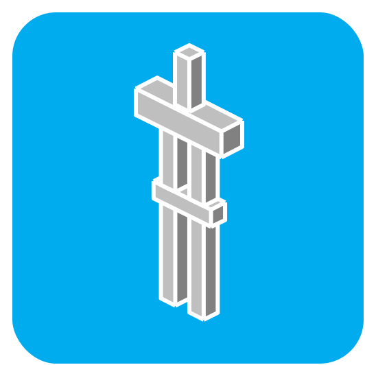

<div align=center>
	
	<h1>🧑‍💻 Contributing to Animated Java</h1>
</div>

Contributions are always welcome, however, please consult @SnaveSutit before starting to avoid duplicates or misalignment of goals. I don't want you to waste all that time and effort on a PR that gets refused! <kbd>Thank you! ❤️</kbd>

<br/>

# 💻 Setting up the Development Environment

### 🛠️ Prerequisites

-   #### Required

    -   [Node.js](https://nodejs.org/en/)
    -   [Yarn](https://classic.yarnpkg.com/lang/en/docs/install/#windows-stable)
    -   [Git](https://git-scm.com/)

-   #### Recommended

    -   [VSCode](https://code.visualstudio.com/)
        > (or any other code editor, but this project has configurations for VSCode)
    -   [Blockbench](https://www.blockbench.net/)
        > The repository includes [Envbench](https://github.com/SnaveSutit/envbench) to create and manage a dev instance of Blockbench, So installing Blockbench separately is not strictly required.
    -   [SnaveSutit's Blockbench Types](https://github.com/SnaveSutit/blockbench-types)
        > Bleeding edge types for Blockbench plugins.<br/>Install via `yarn add -D https://github.com/SnaveSutit/blockbench-types.git`
    -   [GitButler](https://gitbutler.com/)
        > A Git client for simultaneous branches on top of your existing workflow.

## 🖇️ Cloning the Repository

1. Clone the repository via git

    > [How do I clone a repository?](https://docs.github.com/en/repositories/creating-and-managing-repositories/cloning-a-repository)

2. Run `yarn install` to install dependencies.

3. Open up `src/blockbenchTypes.d.ts` and replace the first line with the following:

    ```ts
    /// <reference types="blockbench-types"/>
    ```

    > By default this references my local fork of the Blockbench types to quickly add / adjust types as needed. So you need to adjust this to the official Blockbench types, or your own fork, if you're not me.

4. Run `yarn dev` to start the development environment, which will watch for changes and recompile the plugin.

5. Open a new terminal, or click `Split` if you're in VSCode's terminal, and run `yarn start` to start the development instance of Blockbench.

6. That's it! You're ready to start developing.

> [!IMPORTANT]
> Note that whenever you make changes, reloading just the plugins won't be enough, you must fully reload Blockbench for the plugin to function as expected.<br>
> You can use <kbd><kbd>CTRL</kbd> + <kbd>SHIFT</kbd> + <kbd>R</kbd></kbd>
> to reload Blockbench, or run `Blockbench.reload()` in the dev-tools console.

## 💬 Adding Localizations

1. Follow the instructions for [Cloning the Repository](#🖇️-cloning-the-repository).

2. Duplicate `src/lang/en.yml` and rename it to match the language you're translating to. (e.g. `fr.yml` for French).

    > See [this page](https://github.com/JannisX11/blockbench/tree/master/lang) for the list of languages Blockbench supports.

3. Start Translating! Make sure to check your changes in Blockbench to ensure they work correctly.

    > [!IMPORTANT]
    > You will see strings that have curly brackets surrounding a number (`{0}`) in them, these are placeholders that indicate where variables should inserted into a string. Make sure to keep them in your translations!

4. Once you're done translating, open a pull request with your changes.
