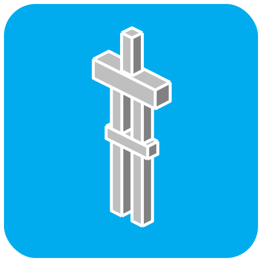

		
	 
	 
	<picture>
		<source media="(prefers-color-scheme: light)" srcset="src/assets/animated_java_title.svg"/>
		
	</picture>

<h3 align="center">
	<i>Effortlessly craft complex animations in Minecraft: Java Edition</i>
</h3>

 

	<kbd>
		
	</kbd>
	<kbd>
		
	</kbd>
	<kbd>
		
	</kbd>
	<kbd>
		
	</kbd>

---

 

# ❔ What is Animated Java?

Animated Java is a cutting-edge Blockbench plugin designed for Minecraft: Java Edition mapmakers and Data Pack developers. By leveraging Blockbench's familiar interface, and the power of Java Edition's Data Pack and Resource Pack systems, Animated Java allows you to create complex animations with ease!

 

# ✨ Key Features

-   **Function API** - Simple, yet powerful, API for summoning, and controlling animated models.

-   **Variants** - Swap between different textures in-game.

-   **Text Displays** - Preview, edit, and animate text displays in Blockbench.

-   **Keyframe Easing Curves** - Create smooth animations with ease.

-   **Locators** - Execute commands using Command Keyframes, teleport entities in an animation, and more.

-   **Animation Tweening** - Smoothly transition be<ins>tween</ins> animations.

-   **Camera Support** - Install the [Official Camera Plugin](https://www.blockbench.net/plugins/cameras) to create cinematic camera paths with ease.

-   **Well Optimized** - Hours of effort have been poured into making Animated Java's Data Pack as low-impact as possible.

-   **Resource Packs are Optional** - Animate Vanilla block and item models using Item and Block Display entities.

-   **Molang Support** - If Blockbench can render your Molang expressions in the preview, you can use it in Animated Java.

 

# 📦 Installation

-   ❔ [Getting Started](https://animated-java.dev/docs/getting-started/using-animated-java)
-   📚 [Documentation](https://animated-java.dev/docs)
-   🕸️ [Website](https://animated-java.dev)
-   🗣️ [Discord](https://animated-java.dev/discord)

 

# 💬 Testimonials

> <q>_I love AJ 3000!_</q>
> — [MrMakistein](https://www.youtube.com/@McMakistein)

> <q>_Wonderful tool, thank you for contributing to the creative possibilities in this game!_</q>
> — [Leroidesafk](https://www.curseforge.com/members/leroidesafk/projects)

> <q>_Super thankful for AJ Snave! Its allowed me to create some insane sh\*\*_</q>
> — [phiac](https://www.youtube.com/channel/UCh2OK3oqxy-_azT-iwcSCag)

> <q>_Thank you for the lovely tool!_</q>
> — [LeCarbonator](https://github.com/LeCarbonator)

 

# 🧑‍💻 Contributing

Contributions are always welcome! Check out [CONTRIBUTING.md](CONTRIBUTING.md) for more information.

 

# ⭐ Star History

<a href="https://star-history.com/#animated-java/animated-java&Date" alt="test">
	<picture>
		<source media="(prefers-color-scheme: dark)" srcset="https://api.star-history.com/svg?repos=animated-java/animated-java&type=Date&theme=dark" />
		<source media="(prefers-color-scheme: light)" srcset="https://api.star-history.com/svg?repos=animated-java/animated-java&type=Date" />
		
	</picture>
</a>
